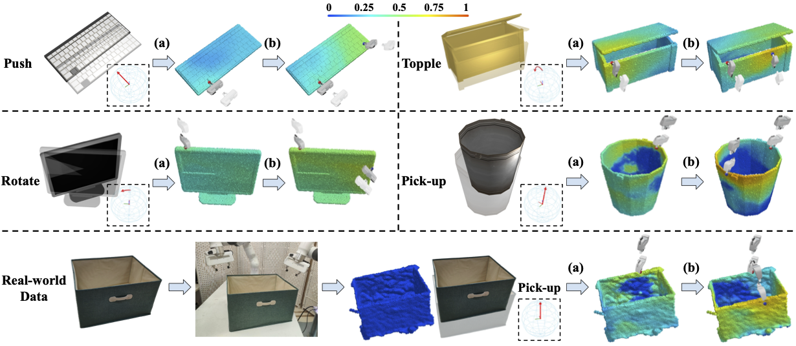

# DualAfford: Learning Collaborative Visual Affordance for Dual-gripper Manipulation




**The Proposed DualAfford Task.** Given different shapes and manipulation tasks (*e.g.*, pushing the keyboard in the direction indicated by the red arrow), our proposed *DualAfford* framework predicts dual collaborative visual actionable affordance and gripper orientations. The prediction for the second gripper (b) is dependent on the first (a). We can directly apply our network to real-world data.

## About the paper

DualAfford is accepted to ICLR 2023.

Our team: [Yan Zhao](https://sxy7147.github.io)\*, [Ruihai Wu](https://warshallrho.github.io)\*, Zhehuan Chen, [Yourong Zhang](https://www.linkedin.com/in/yourong-zhang-2b1aab23a/), [Qingnan Fan](https://fqnchina.github.io), [Kaichun Mo](https://kaichun-mo.github.io) and [Hao Dong](https://zsdonghao.github.io).

(* indicates joint first authors)

Arxiv Version: https://arxiv.org/pdf/2207.01971.pdf

Project Page: https://hyperplane-lab.github.io/DualAfford/


## Before start
To train the models, please first go to the `data` folder and download the pre-processed SAPIEN dataset for DualAfford. 
To test over the pretrained models, please go to the `logs` folder and download the pretrained checkpoints.

I will release the dataset and the pretrained models before April 28th.

## Dependencies
This code has been tested on Ubuntu 18.04 with Cuda 10.1, Python 3.6, and PyTorch 1.7.0.

First, install SAPIEN

    pip install http://storage1.ucsd.edu/wheels/sapien-dev/sapien-0.8.0.dev0-cp36-cp36m-manylinux2014_x86_64.whl


Then, if you want to run the 3D experiment, this depends on PointNet++.

    git clone --recursive https://github.com/erikwijmans/Pointnet2_PyTorch
    cd Pointnet2_PyTorch
    # [IMPORTANT] comment these two lines of code:
    #   https://github.com/erikwijmans/Pointnet2_PyTorch/blob/master/pointnet2_ops_lib/pointnet2_ops/_ext-src/src/sampling_gpu.cu#L100-L101
    pip install -r requirements.txt
    pip install -e .

Finally, run the following to install other packages.

    # make sure you are at the repository root directory
    pip install -r requirements.txt

to install the other dependencies.

For visualization, please install blender v2.79 and put the executable in your environment path.
Also, the prediction result can be visualized using MeshLab or the *RenderShape* tool in [Thea](https://github.com/sidch/thea).

## Generate Offline Training Data
Before training the network, we need to collect a large set of interaction trials via random exploration.

To generate offline training data for the `pushing` task, run the following command:

    sh scripts/run_collect_random_push_TRAIN.sh

Note that the scripts for other tasks are similar. You can modify the content of the script file to generate data for different settings. Also, please modify the `num_processes` parameter to specify the number of CPU cores to use.

## Training Pipeline for the DualAfford Framework

We also use the experiments for the `pushing` task as an example, and scripts for other tasks are similar.

#### Train the Second Gripper Module (M2)

As mentioned in our paper, we start with training the Second Gripper Module (M2). To train M2, we first train its Critic Module (C2) and Proposal Module (P2) simultaneously (the Proposal Module is also noted as actor in our code).

To train C2 and P2, run:

    sh scripts/run_train_critic_push_sec.sh
    sh scripts/run_train_actor_push_sec.sh

Then, after pretraining C2 and P2, we can train the Affordance Module (A2) for the Second Girpper Module. Please specify the checkpoints of the pretrained C2 and P2.

    sh scripts/run_train_affordance_push_sec.sh

#### Train the First Gripper Module (M1)

The First Gripper Module (M1) is trained with the awareness of the trained M2. In M1, we also train its Critic Module (C1) and Proposal Module (P1) first. Note that to train C1, we should specify the pre-trained checkpoint of the Second Gripper Module (M2).

To train C1 and P1, run:

    sh scripts/run_train_critic_push_fir.sh
    sh scripts/run_train_actor_push_fir.sh

Then, after pretraining C1 and P1, we can train the Affordance Module (A1) for the Frist Girpper Module. Please specify the checkpoints of the pretrained C1 and P1.

    sh scripts/run_train_affordance_push_fir.sh

#### The Collaborative Adaptation Procedure

To further enhance the collaboration between the two gripper modules, we introduce the Collaborative Adaptation procedure. In this procedure, the proposed dual-gripper actions are simultaneously executed in the simulator, using interaction outcomes to update the two gripper modules.

To run the Collaborative Adaptation procedure, use the following command:

    sh scripts/run_train_CA_push.sh

## Evaluation

To evaluate and visualize the results, run the following command:

    sh scripts/run_eval_push_afterCA.sh

This will use the pretrained networks to propose interactions in the simulation, and the manipulation results are saved in `gif` format. We also visualize the affordance maps proposed by the two Affordance Modules (A1 and A2) in this code.


## Citations

```
@inproceedings{zhao2023dualafford,
  title={DualAfford: Learning Collaborative Visual Affordance for Dual-gripper Manipulation},
  author={Yan Zhao and Ruihai Wu and Zhehuan Chen and Yourong Zhang and Qingnan Fan and Kaichun Mo and Hao Dong},
  booktitle={International Conference on Learning Representations},
  year={2023},
}
```

## Questions

Please post issues for questions and more helps on this Github repo page. We encourage using Github issues instead of sending us emails since your questions may benefit others.

## License

MIT Licence
